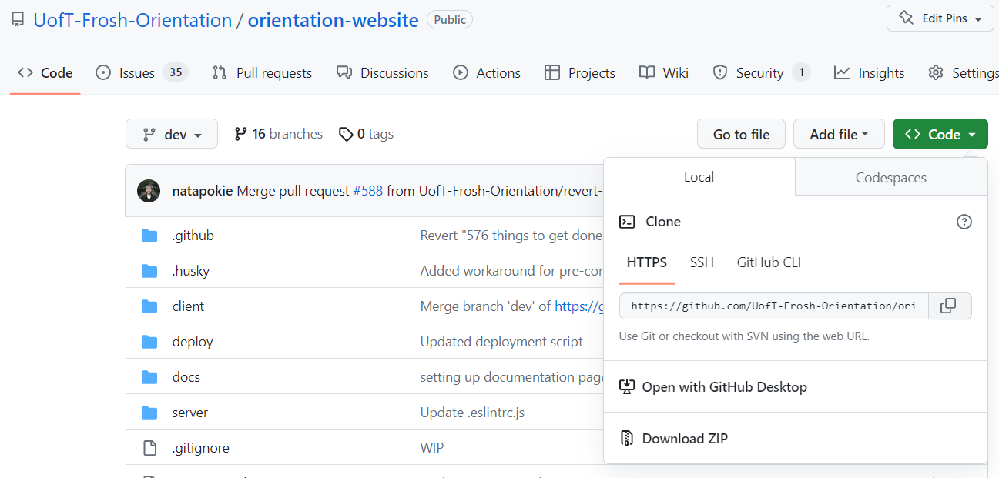
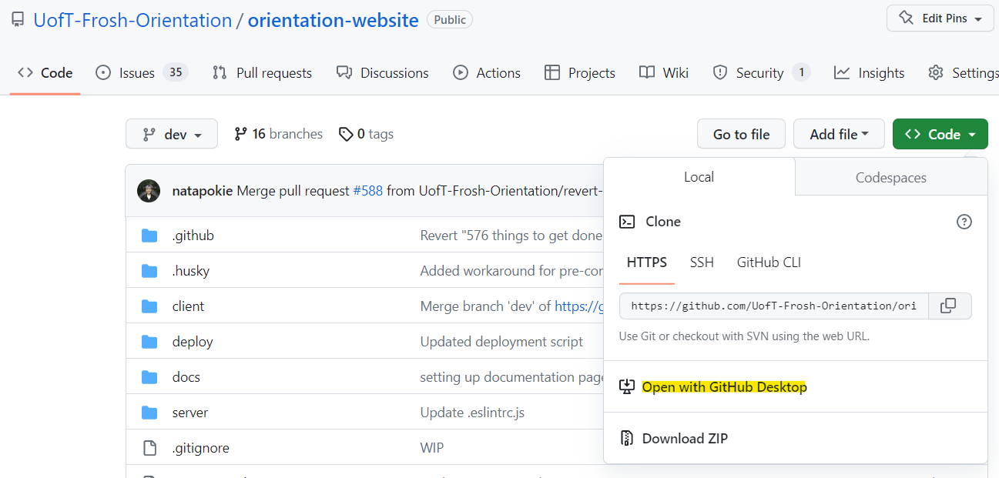
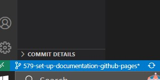
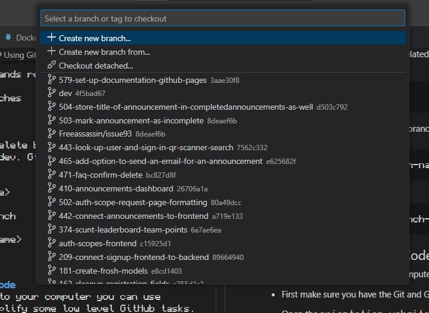
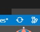
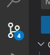
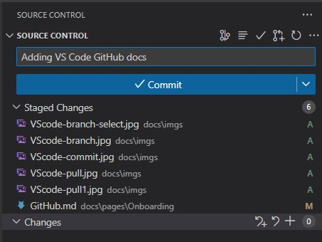
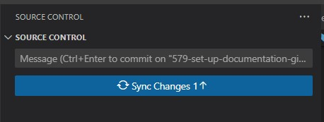

# Git & GitHub

## Table of contents
{: .no_toc .text-delta }

1. TOC
{:toc}

---

## Intro to Git

For those that have not used Git before, Git is a type of version control which means that it tracks changes between different files, allowing many people to work on the same project together.

Make sure to install git by clicking the link [here](https://git-scm.com/downloads)!

## Cloning GitHub Repos

There are two ways to clone repositories on GitHub, either through your command prompt or using GitHub Desktop.

### Command Prompt

1. Navigate to the code repository on GitHub, i.e., the [Orientation Website repository](https://github.com/UofT-Frosh-Orientation/orientation-website)

2. Click the green **Code** button, and copy the **HTTPS key**

    

3. Open your command prompt
    + On Windows, search up **cmd** or **Command Prompt** by clicking on the Windows Key
    + On Mac, open the **Terminal App**

4. Navigate to the directory that you want to save the repository locally
    + On Windows, `dir` into the desired folder
    + On Mac, `cd` into the desired folder

5. Enter the following
    ```
    git clone <paste HTTPS key>
    ```

And your repository has been cloned! You can open with your prefered IDE and start making changes!

### GitHub Desktop

Before beginning make sure to download [GitHub Desktop](https://desktop.github.com/).

1. Navigate to the code repository on GitHub, i.e., the [Orientation Website repository](https://github.com/UofT-Frosh-Orientation/orientation-website)

2. Click the green **Code** button, and click "Open with GitHub Desktop"

    

3. Follow the GitHub Desktop prompts!

{: .new-note }
We recommend using GitHub Desktop because it's really easy to make pull requests! A prompt would show up after you make a push and it would take you to GitHub.

## Git Commands

For those that have not used much Git before, here's a small intro with important commands!

Since you have now officially set up our Git repo locally (on your machine), any changes you make with any files will immediately be tracked.

1. Make sure you're on the dev branch by typing `git switch dev`, and `git pull` into the terminal before doing anything else! By making this pull, you're pulling all the changes from the GitHub repo to make sure that the changes on your machine are the up to date with the GitHub repository

    ```
    git switch dev
    git pull 
    ```

    {: .new-important }
    You need to make a new branch before you make changes to any files, but we'll explain that later!

2. Lets say you've make some changes to a couple of files and added some new files, and you want to push these changes to dev on GitHub
    + Use `git status` to check on the status of your files, this will indicate **Untracked files**, i.e., the files that you've changed
    + You can use `git add` to add these untracked files. Use the period **.** after add to add *all* files, you can also specify certain files that you want to add

    ```
    git status
    git add .
    git add <file path>
    ```

3. Once you've added all the untracked files, you'll have to commit your changes before pushing these changes to GitHub. Make sure to add a commit message to describe the changes you made

    ```
    git commit -m "message describing changes you made"
    ```

    {: .new-note }
    Make as many commits as you need but not too many so that each commit is a one-liner! This will help you keep track of your progress, and will help you recover changes in case you made a mistake!

4. You're ready to push these changes to GitHub!

    ```
    git push
    ```

5. Finally, with your new changes, you're gonna create a pull request (PR)
    + You can create a pull request through GitHub Desktop
    + Or you can create a pull request through GitHub on the browser!

## Git Feature Branches

We mentioned before that you need to make a new branch before making changes to files.

These branches allow multiple people to work on the code at once, and then after their changes are done (i.e., they've completed the feature that they're working on) the code can be merged into the main branch dev!

{: .new-important }
We don't want to work directly on the dev branch because this is what the users will see! We use branches so that we can do code reviews and test before releasing our new features!

Here are some steps before you start working on a new feature!

1. Switch to the dev branch and sync (pull) the latest version
    ```
    git switch dev
    git pull
    ```
2. Create a new branch based on the current branch, dev. Enter the name of your branch under `branch-name`.
    ```
    git checkout -b <branch-name>
    ```

    {: .new-important }
    Make sure to pick an appropriate name for your branch! Usually the **issue#-issue-name**. GitHub on the browser can also make branches for you when you navigate to the Issue > Development > Create a branch

3. Switch to the newly created branch (if it didn't switch automatically)

    ```
    git switch <branch-name>
    ```

Some other important Git commands related to branching!

* View a list of all the branches
    ```
    git branch
    ```
* Delete branch, we usually delete branches after the pull request has been merged with dev. GitHub can also delete your branch after merged!
    ```
    git branch -d <branch-name>
    ```
* To pull from a specific branch
    ```
    git pull origin <branch-name>
    ```

## Using Git & Github in VS Code
After cloning a repository onto your computer you can use built-in VS code tools to simplify some low level GitHub tasks.

- First make sure you have the Git and GitHub extensions installed on VS code.

- Open the `orientation-website` folder in VS code.
### Changing Branches
To change branches: 
- click on the bottom left box

    

- This will open the selection bar. Here you can type the number / name of the branch you want to check out.

    

### Pulling Changes:
To pull changes:

- Either use the refresh icon next to the branch selection box from before

    

- You can also navigate to the `Source Control` tab on the right menu and click the synchronize button.  

    

### Making Commits

After writing your code you can navigate to the `Source Control` tab and stage all your changes. You can do this by clicking on the + button next to the changes tab




